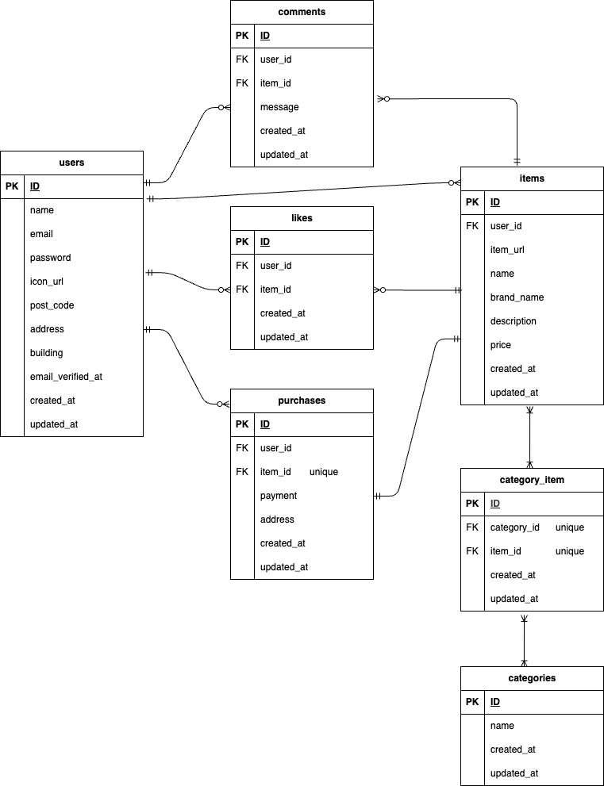

# フリマアプリ

## プロジェクト概要

サービス名：coachtechフリマ  
サービス概要：ある企業が開発した独自のフリマアプリ  
制作の背景と目的：アイテムの出品と購入を行うためのフリマアプリを開発  
制作の目標：初年度でのユーザー数1000人達成  
ターゲットユーザー：10−30代の社会人  
ターゲットブラウザ・OS：PC（Chrome/Firefox/Safari　最新バージョン）  

## 環境構築

Dockerビルド

1. git clone  git@github.com:yuri-tomabechi/frema-app.git
2. docker-compose up -d build

*MySQLは、OSによって起動しない場合があるのでそれぞれのPCに合わせてdocker-compose.ymlファイルを編集してください。

Laravel環境構築

1. docker-compose exec php bash
2. composer install
3. cp .env.example .env  .env.exampleファイルから.envを作成し、環境変数を変更

4. php artisan key:generate
5. php artisan migrate
6. php artisan db:seed

## 使用技術
フロントエンド：HTML/CSS/Blade  
バックエンド：  
・PHP  
・Laravel  
データベース  
・MySQL  
開発環境：Docker/Docker Compose

## URL
・開発環境：
・phpMyAdmin:

## ER図

