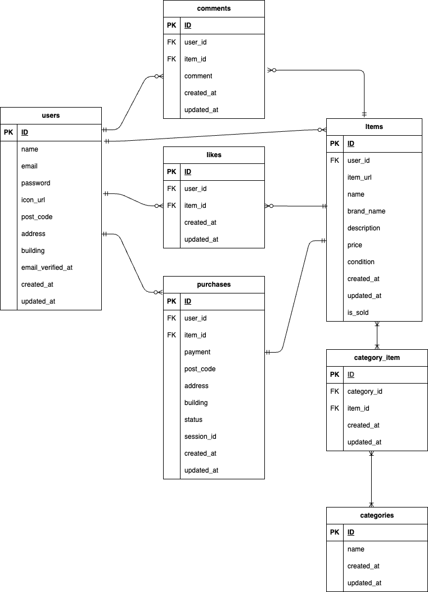

# フリマアプリ

## プロジェクト概要

サービス名：coachtechフリマ  
サービス概要：ある企業が開発した独自のフリマアプリ  
制作の背景と目的：アイテムの出品と購入を行うためのフリマアプリを開発  
制作の目標：初年度でのユーザー数1000人達成  
ターゲットユーザー：10−30代の社会人  
ターゲットブラウザ・OS：PC（Chrome/Firefox/Safari　最新バージョン）  

## 主要機能
・ユーザー登録/ログイン  
・出品/購入  
・商品一覧・検索  
・お気に入り登録  
・コメント機能  

## 環境構築
Dockerビルド

1. git clone  git@github.com:yuri-tomabechi/frema-app.git  
2. docker-compose up -d build  

*MySQLは、OSによって起動しない場合があるのでそれぞれのPCに合わせてdocker-compose.ymlファイルを編集してください。  

Laravel環境構築

1. docker-compose exec php bash  
2. composer install  
3. cp .env.example .env  .env.exampleファイルから.envを作成し、DB設定を変更（下記参照）   
4. php artisan key:generate  
5. php artisan migrate  
6. php artisan db:seed  
7. php artisan storage:link

## データベース設定(.env)
DB_CONNECTION=mysql  
DB_HOST=mysql  
DB_PORT=3306  
DB_DATABASE=frema_app  
DB_USERNAME=laravel_user  
DB_PASSWORD=laravel_pass  

## mailhog(.env)
MAIL_MAILER=smtp  
MAIL_HOST=mailhog  
MAIL_PORT=1025  
MAIL_USERNAME=null  
MAIL_PASSWORD=null  
MAIL_ENCRYPTION=null  
MAIL_FROM_ADDRESS=example@frema-app.test  
MAIL_FROM_NAME="${APP_NAME}"  

## 認証について
本アプリケーションでは Laravel Fortify を使用しています。
.env には以下の設定が必要です。

FORTIFY_ENABLED=true  
FORTIFY_FEATURES=registration,login,email-verification

## テスト
1. cp .env .env.testing  
2. .env.testingのDBの設定を以下に変更  
    DB_CONNECTION=mysql  
    DB_HOST=mysql  
    DB_PORT=3306  
    DB_DATABASE=demo_test  
    DB_USERNAME=root  
    DB_PASSWORD=root  

## 使用技術
・フロントエンド：HTML/CSS/Blade/JavaScript  
・バックエンド： PHP/Laravel 8.83.8  
・データベース：MySQL  
・開発環境：Docker/Docker Compose  
・その他：Fortify/Stripe/MailHog  

## Stripe
STRIPE_KEY=xxxxx  
STRIPE_SECRET=xxxxx  
※設定お願いします  

## ログイン情報
名前 : 山田太郎  
メールアドレス : taro.0123@icloud.com  
パスワード : 12341234  

※管理者ユーザーはなし  

## クレジットカード
クレジットカード番号：4242 4242 4242 4242  

## URL
・開発環境：http://localhost  
・phpMyAdmin: http://localhost:8080/  

## ER図
  

